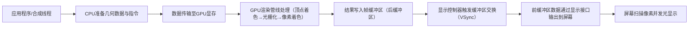

GPU（图形处理器）将内容输出到屏幕的过程是一个涉及**图形渲染管线（Graphics Rendering Pipeline）**、**显示控制器（Display Controller）**和**硬件交互**的复杂流程。以下是其核心步骤和原理的详细解析：

### **一、GPU渲染管线：从数据到图像的生成**

GPU的核心任务是将3D/2D图形数据（如顶点坐标、纹理、变换矩阵等）转换为屏幕上的像素值。这一过程通过**渲染管线**的多个阶段流水线式处理，主要分为以下步骤：

#### **1. 应用阶段（Application Stage）**

- **数据准备**：  
  由CPU或渲染引擎（如游戏引擎、浏览器合成线程）提供几何数据（顶点坐标、法线、纹理坐标等）和渲染指令（如“绘制三角形”“应用纹理”）。
- **粗粒度剔除**：  
  剔除不可见的物体（如被其他物体遮挡或超出视锥体范围的对象），减少后续计算量。
- **数据传输**：  
  将数据从系统内存（RAM）传输到GPU显存（VRAM），供后续阶段使用。

#### **2. 几何阶段（Geometry Stage）**

- **顶点着色器（Vertex Shader）**：
  - 对每个顶点进行坐标变换（如模型变换、视图变换、投影变换），将3D坐标转换为2D屏幕坐标（齐次裁剪空间）。
  - 计算顶点属性（如颜色、纹理坐标、光照影响）。
  - **输出**：标准化设备坐标（NDC，范围[-1, 1]）和顶点属性。
- **图元装配（Primitive Assembly）**：  
  将顶点组合为图元（如三角形、线段），确定图元在屏幕上的覆盖区域。
- **裁剪（Clipping）**：  
  剔除完全在视口外的图元，保留部分可见图元并裁剪超出视口的部分。

#### **3. 光栅化阶段（Rasterization Stage）**

- **像素坐标计算**：  
  将裁剪后的图元坐标从NDC转换为屏幕实际像素坐标（如1920×1080分辨率下的坐标范围[0, 1919]×[0, 1079]）。
- **像素着色器（Fragment Shader）**：
  - 对图元覆盖的每个像素（片段）进行计算，如采样纹理、应用光照、混合颜色等。
  - **输出**：每个像素的最终颜色值和深度值（用于处理遮挡关系）。
- **抗锯齿（Anti-aliasing，AA）**：  
  处理像素边缘模糊问题，通过多重采样或算法混合相邻像素颜色。

#### **4. 输出合并阶段（Output-Merger Stage）**

- **深度测试（Depth Test）**：  
  比较当前像素与帧缓冲区中已有像素的深度值，保留离观察者更近的像素（解决前后遮挡问题）。
- **模板测试（Stencil Test）**：  
  根据模板缓冲区中的掩码（如自定义遮罩）选择性渲染像素。
- **混合（Blending）**：  
  将当前像素颜色与帧缓冲区中的颜色按规则混合（如透明度混合）。
- **写入帧缓冲区**：  
  将最终像素颜色写入**帧缓冲区（Frame Buffer）**和**深度缓冲区（Depth Buffer）**。

### **二、从GPU到屏幕：显示输出的硬件交互**

完成渲染后，GPU需要将帧缓冲区中的像素数据输出到物理屏幕，这涉及以下硬件组件和流程：

#### **1. 帧缓冲区与双缓冲机制**

- **帧缓冲区（Frame Buffer）**：  
  是GPU显存中的一块区域，存储着当前渲染完成的图像像素数据（RGB值或RGBA值）。
- **双缓冲（Double Buffering）**：
  - GPU同时维护**前缓冲区（Front Buffer）**和**后缓冲区（Back Buffer）**。
  - 前缓冲区用于向屏幕输出当前显示的图像，后缓冲区用于渲染下一帧图像。
  - 渲染完成后，通过**缓冲区交换（Swap Buffers）**将后缓冲区切换为前缓冲区，避免画面撕裂。

#### **2. 显示控制器（Display Controller）**

- **功能**：  
  负责从帧缓冲区中读取像素数据，并按屏幕的**刷新率（如60Hz、144Hz）**和**扫描方式（逐行扫描）**将数据输出到显示接口（如HDMI、DP）。
- **垂直同步（VSync）**：
  - 显示控制器在每次**垂直消隐期（Vertical Blank Interval，VBI）**（即屏幕扫描完一帧，准备开始下一帧的间隔）触发缓冲区交换。
  - 确保渲染帧率与屏幕刷新率同步，防止画面撕裂，但可能引入延迟。

#### **3. 物理屏幕的显示原理**

- **液晶显示器（LCD）**：
  - 显示接口传输的电信号控制**时序控制器（TCON）**，TCON将信号转换为驱动电压，控制液晶分子偏转。
  - 背光通过偏转的液晶分子和彩色滤光片，形成不同颜色的像素。
- **有机发光二极管（OLED）**：
  - 电信号直接驱动像素内的有机发光材料发光，无需背光，每个像素可独立控制开关和亮度。

### **三、关键技术细节与优化**

#### **1. 管线并行与硬件加速**

- **流水线设计**：  
  渲染管线的各个阶段（顶点着色、光栅化等）并行执行，例如顶点着色器处理下一帧顶点时，光栅化阶段可同时处理前一帧的图元。
- **专用硬件单元**：  
  GPU包含独立的**顶点处理单元**、**像素处理单元**、**几何着色器单元**等，可并行处理大量数据（如 thousands of vertices/pixels per second）。

#### **2. 同步与性能平衡**

- **异步渲染（Asynchronous Rendering）**：  
  GPU可在CPU处理下一帧逻辑时，独立渲染当前帧，减少CPU与GPU的依赖。
- **帧率限制（FPS Capping）**：  
  通过软件或驱动限制渲染帧率，避免GPU过度工作（如超过屏幕刷新率时），降低功耗和发热。

#### **3. 常见问题与解决方案**

- **画面撕裂（Screen Tearing）**：  
  由于缓冲区交换与屏幕扫描不同步导致，开启VSync可解决，但可能牺牲帧率。
- **卡顿（Stuttering）**：  
  由渲染帧率不稳定（如帧率波动超过刷新率容差）引起，可通过**自适应同步技术（Adaptive Sync，如FreeSync/G-Sync）**动态匹配GPU帧率与屏幕刷新率。

### **四、总结：GPU到屏幕的完整链路**

**核心原理**：  
GPU通过渲染管线将抽象的图形数据转化为像素值，存储在帧缓冲区中，再由显示控制器按固定频率读取并输出到屏幕。整个过程利用**并行计算**、**双缓冲机制**和**硬件同步技术**，实现高效、流畅的图像显示。
